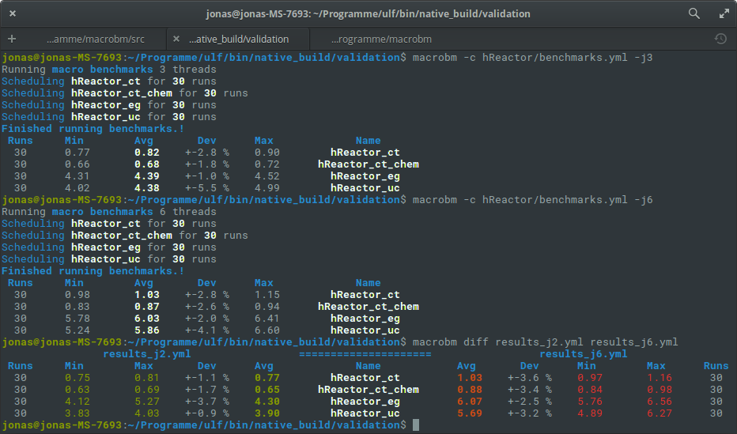

# MacroBM - A tool to run MacroBenchmarks
[](https://travis-ci.org/JonasToth/macrobm)

This repository hosts a tool called `macrobm` that runs benchmarks for
arbitray commands.
It is able to output statistics of multiple iterations of a command and compare different
runs of the same benchmark.



## Quickstart

`macrobm` is inspired by `linux perf` and tries to be useable with almost no configuration!

All `macrobm` needs is a `benchmarks.yml` file containing the commands for the benchmark.

```yaml
# benchmarks.yml
cases:
    - name: "sleep_long"     # optional, will default to command
      command: "/bin/sleep"  # command to execute
      args: ["5",]           # list of arguments passed to the command
      count: 5               # how often the command is run
```

```sh
$ macrobm # directory must contain benchmarks.yml
> Running macro benchmarks 1 threads
> Scheduling sleep_long for 5 runs
> Finished running benchmarks!
> Runs     Min        Avg       Dev      Max             Name
>   5       5.01       5.01    +-0.0 %    5.01         sleep_long
# 'results.yml' has been written
$ macrobm report # inspects results.yml, same as report output from the run
$ macrobm diff ground_truth.yml # compare ground_truth.yml with results.yml
```

## Usage

Values defined outside the `cases` subsection will be used as default
arguments. So you can configure everything outside cases, and just vary with
your `args` when comparing one program with different configurations.

All input and output parameters, especially filenames, can be specified with
command line arguments, see `macrobm --help` for more. You can utilize many cores of your 
machine, using the `-jN` parameter. Note that this might have impact on your execution 
time of the program.

Currently the errorhandling is shaky, whenevery panics occur, e.g. the
execution directory does not exist, the program is bad at recovering. Hit
CTRL-C and fix your configuration! This will improve once it is ready to get
released.


```yaml
count: 30
command: "../ulf.x"
cases:
    - name: "hReactor_ct"
      args: ["-f", "hReactor/hReactor_ct.ulf"]
                                                   
    - name: "hReactor_ct_chem"
      args: ["-f", "hReactor/hReactor_ct_chem.ulf"]
                                                   
    - name: "hReactor_eg"
      args: ["-f", "hReactor/hReactor_eg.ulf"]
                                                   
    - name: "hReactor_uc"
      args: ["-f", "hReactor/hReactor_uc.ulf"]
```

This is a configuration file for a numeric code evaluating the runtime of a 
flame-solver depending on the solverbackend.
Again, everything is configurable "above" cases, defaulting it for the cases
and can be overwritten by each case.

```sh
$ macrobm -o results_j2.yml -j2
$ macrobm -o results_j6.yml -j6
$ macrobm diff results_j2.yml results_j6.yml
>                results_j2.yml                 =====================                 results_j6.yml
> Runs     Min        Max       Dev      Avg             Name            Avg       Dev      Min        Max      Runs 
>  30      0.75       0.81    +-1.1 %    0.77        hReactor_ct         1.03    +-3.6 %    0.97       1.16      30
>  30      0.63       0.69    +-1.7 %    0.65      hReactor_ct_chem      0.88    +-3.4 %    0.84       0.98      30
>  30      4.12       5.27    +-3.7 %    4.30        hReactor_eg         6.07    +-2.5 %    5.76       6.56      30
>  30      3.83       4.03    +-0.9 %    3.90        hReactor_uc         5.69    +-3.2 %    4.89       6.27      30
# Note the difference in performance from multithreaded benchmarking!
```

## Features Todo

- check subcommand, that will compare the statistics against a defined
  requirement and return 0 or -1 if the requirements are met or not. usefull
  for ci - mid 
- allow environment variables in the configuration that will be set when
  running the command for each measurement
- 'who-wins' subcommand to compare many results and find the winner for each category and case - mid
- Spawn runs until statistics stabilize - low and not easy with current
  spawning
- allow groups in the config, hierarchy, until "cases" is found. These are then
  used to configure the runs, the rest are namespaces - low, files are enough i think


## Tests Todo

relevance in the given order

- loading results give correct results

## Way later
- submit subcommand to build a database of historic data
